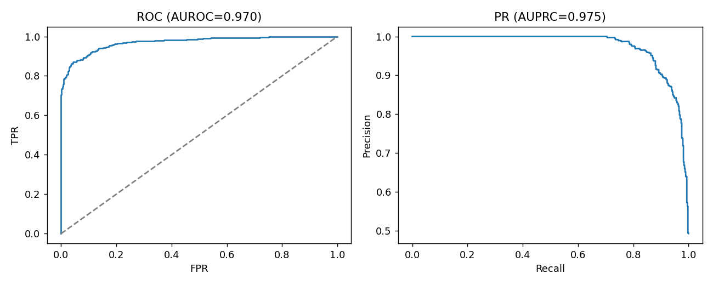
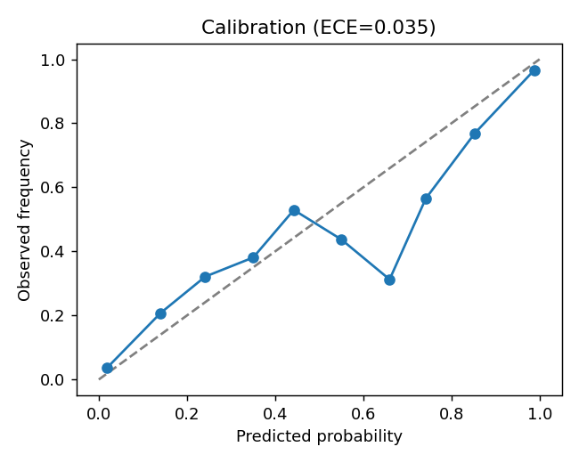
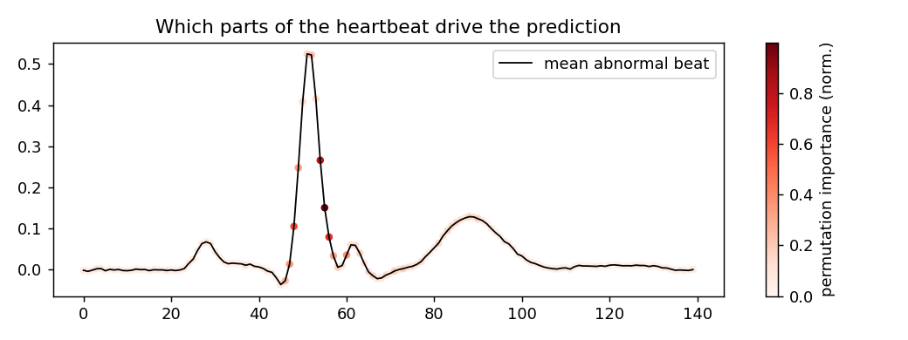

# ECG Heartbeat Classification (ecgnet)

Reproducible machine-learning pipeline that classifies single-heartbeat ECG
traces as **normal vs. abnormal**, with rigorous evaluation, probability
calibration, and signal-level interpretability. Built as a compact, honest
demonstration of responsible ML for physiological signals.


## Why this project

Wearable and clinical ECG is one of the highest-impact settings for computational
precision health: models must be **accurate, well-calibrated, and interpretable**
before they can support care. This repo implements that full loop end to end on a
single, well-known heartbeat benchmark.

## Results

Test-set performance (held-out 1,000 beats, seed=42):

| Metric | Score |
|---|---|
| AUROC | **0.970** |
| AUPRC | **0.975** |
| F1 (@0.5) | 0.901 |
| Accuracy | 0.903 |
| Brier score | 0.068 |
| Expected Calibration Error | 0.035 |

Model selection (by validation AUROC): **neural network / MLP — 0.960** vs.
gradient-boosting baseline — 0.934.

| ROC & PR | Calibration | Interpretability |
|---|---|---|
|  |  |  |

> **Data note.** Running `python scripts/run.py` auto-downloads the real
> **ECG5000** dataset (PhysioNet, 5,000 beats). The figures and numbers above
> were produced on the bundled **realistic synthetic ECG benchmark**, because
> the build environment had no outbound network. Re-run on a networked machine
> to reproduce on real ECG5000 — the pipeline switches automatically and the
> results refresh.

## Methods

- **Data** — 140-sample single-lead heartbeats; stratified train/val/test split;
  standardization fit on training data only (no leakage). Synthetic fallback
  injects overlapping pathologies (T-wave inversion, ST shift, conduction
  change, ectopic beats) so the task stays non-trivial offline.
- **Models** — an MLP neural network (early stopping) and a gradient-boosting
  baseline; the better validation model is selected and evaluated once on test.
- **Evaluation** — AUROC, AUPRC, F1, accuracy, plus **Brier score and ECE** for
  calibration (clinically essential, often omitted).
- **Interpretability** — permutation importance over the time axis, overlaid on
  the mean abnormal beat, to show *which parts of the waveform* drive predictions.

## Reproduce

```bash
pip install -r requirements.txt
python scripts/run.py      # trains, evaluates, writes results/
pytest -q                  # unit tests
```

## Structure

```
src/ecgnet/      data.py · model.py · pipeline.py
scripts/run.py   end-to-end entry point
tests/           unit tests (data, model, fit/predict)
results/         metrics.json + figures (regenerated on run)
config.yaml      seeds & hyperparameters
MODEL_CARD.md    intended use, data, metrics, limitations
```

## Responsible use

This is a research/education project, **not** a medical device. See
[`MODEL_CARD.md`](MODEL_CARD.md) for intended use, calibration behavior, and
limitations.

## Author

Yassine Chouikh — M.S. Health Data Science, UCSF. License: MIT.
